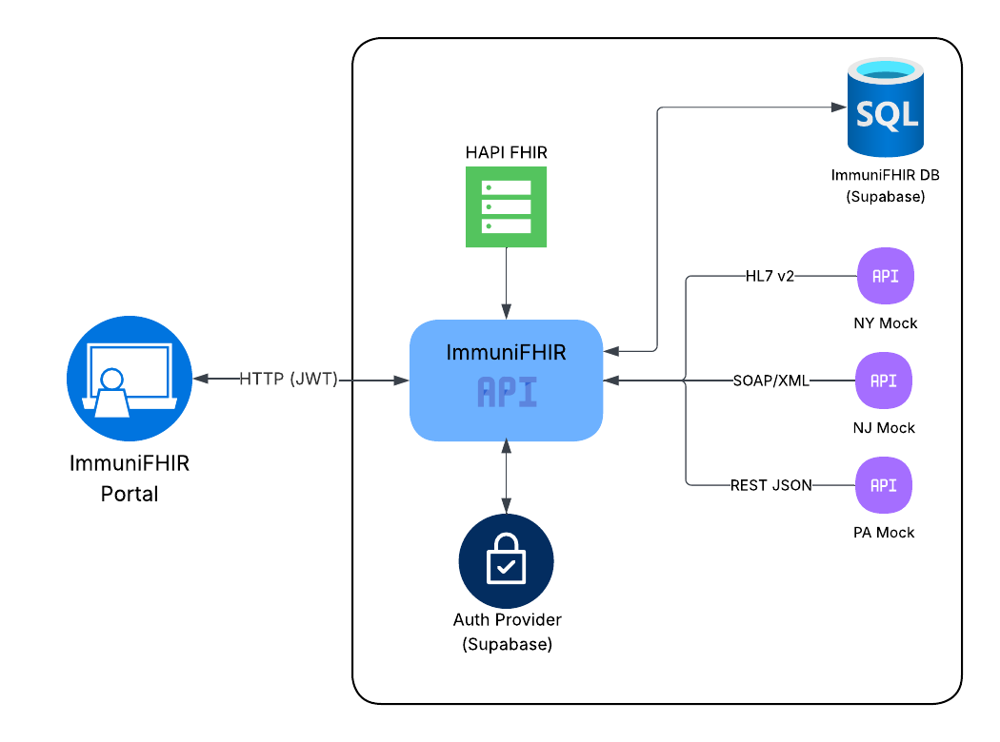

# ImmuniFHIR Backend  
**CS 6440 — Introduction to Health Informatics**  
**Team Avengers**

---
## Production URLs—ACCESS APPLICATION HERE 
- Frontend: https://cs6440-team-avengers-1-frontend.onrender.com
-  HEADS UP - Since this is on the free plan of render, when a user clicks on the FE to try the product, they will have to wait 1-2 minutes for the render to go up. All statuses will be present to show user progress until they can access the official app. Thank you for your patience! 
- Backend: https://cs6440-team-avengers-1-backend.onrender.com

## Project Overview
ImmuniFHIR is a multi-state immunization aggregation platform developed for CS 6440 (Team Avengers).
The system retrieves immunization data from mock state registries (NY, NJ, PA), parses HL7 v2.x messages, normalizes them, persists data in Supabase, and presents the results through a secure Vue.js frontend.



This README includes:
- Backend documentation
- Frontend documentation
- Architecture diagram
- Mockups
- Test data location
- Setup & deployment instructions

---

## Tech Stack

- **Language:** Python 3.10  
- **Framework Backend:** FastAPI
- **Framework Frontend:** Vue 3, Vie  
- **Database & Auth:** Supabase (PostgreSQL)  
- **Deployment:** Render (Free Plan)
- **CI/CD:** GitHub Actions  
- **Testing:** Pytest

---

## Test Data
 Location:
 CS6440-Team-Avengers/immunifhir-backend/schema

Includes:
- HL7 sample VXU messages (NY, NJ, PA)
- Test patients

Used for:
- HL7 → JSON → FHIR testing
- Unit tests
- Aggregation validation

---

## Running the Backend App Locally
- cd immunifhir-backend 
- python -m venv venv
- source venv/bin/activate
- pip install -r requirements.txt
- export SUPABASE_URL="askteam"
- export SUPABASE_KEY="askteam"
- export BYPASS_AUTH=true
- export SUPABASE_JWT_AUD=authenticated
- export JWT_SECRET=your_supabase_jwt_secret
- uvicorn app.main:app --reload
- The app will be available at http://127.0.0.1:8000

---

## Front-end Documentation 
Front-End Stack: Vue.js, Pinia, Vite

Features
- Multi-State Search: Query immunization records across NY, NJ, and PA simultaneously
- Live Aggregation: Real-time data fetched from state registries (not cached)
- Patient Management: Search patients by name and date of birth
- Immunization History: View complete vaccination records with sorting and filtering
- State Summary: See record counts per state registry
- Secure Authentication: JWT-based auth with Supabase

## Run the Front-End Application Locally
- cd immunifhir-frontend/immunifhir-frontend
- npm install
- export VITE_BACKEND_URL=http://127.0.0.1:8000
- export VITE_SUPABASE_URL=your_url
- export VITE_SUPABASE_ANON_KEY=your_key
- npm run dev
- The app will be available at http://127.0.0.1:5173 or your respective localhost.

## Test Data and Login Credentials

 Email: tester@testing.com
 Password: Password1!

 Sample Patient Records (Available in all three states)

 1. Trinity Han
    - DOB: 1980-02-10 (02/10/1980)
    - Search with: First name "Trinity", Last name "Han"
    - Multiple immunization records across NY, NJ, PA
 2. Lorena Martinez
   - DOB: 1980-02-10 (02/10/1980)
   - Search with: First name "Lorena", Last name "Martinez"
   - Vaccination history from multiple states
 3. John Doe
   - DOB: 1980-02-10 (02/10/1980)
   - Search with: First name "John", Last name "Doe"
   - Common test patient with extensive records
 4. Patricia Garcia
   - DOB: 1980-02-10 (02/10/1980)
   - Search with: First name "Patricia", Last name "Garcia"
   - Multi-state immunization history
 5. AG Lopez
   - DOB: 1980-02-10 (02/10/1980)
   - Search with: First name "AG", Last name "Lopez"
   - Records from NY, NJ, and PA registries
 6. Mario Rivera
   - DOB: 1980-02-10 (02/10/1980)
   - Search with: First name "Mario", Last name "Rivera"
   - Complete vaccination records
 7. Margarita Doe
   - DOB: 1980-02-10 (02/10/1980)
   - Search with: First name "Margarita", Last name "Doe"
   - Test patient with multi-state data
 8. Miguel Montana
   - DOB: 1980-02-10 (02/10/1980)
   - Search with: First name "Miguel", Last name "Montana"
   - Comprehensive immunization history

## System Architecture

  ```mermaid
  sequenceDiagram
      participant User
      participant Frontend as Vue.js Frontend
      participant Backend as FastAPI Backend
      participant NY as NY Registry
      participant NJ as NJ Registry
      participant PA as PA Registry

      User->>Frontend: Enter patient name
      Frontend->>Backend: POST /search-immunizations

      par Query all registries
          Backend->>NY: GET /records
          Backend->>NJ: GET /records
          Backend->>PA: GET /records
      end

      NY-->>Backend: NY immunization data
      NJ-->>Backend: NJ immunization data
      PA-->>Backend: PA immunization data

      Backend->>Backend: Aggregate results
      Backend-->>Frontend: Combined records JSON
      Frontend-->>User: Display immunization records


